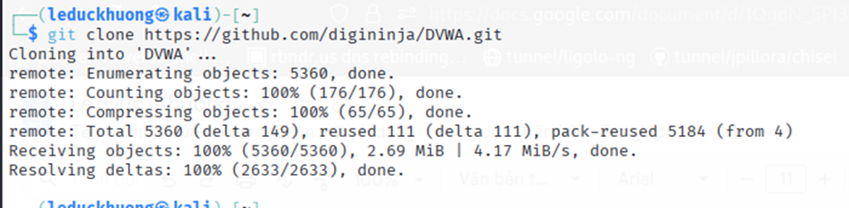

# Hướng dẫn Cài đặt & Cấu hình reNgine và DVWA

## Mục lục

1. [Cài đặt và cấu hình reNgine](#cai-dat-va-cau-hinh-ren-gine)

   1. [Bước 1: Chuẩn bị môi trường](#buoc-1-chuan-bi-moi-truong)
   2. [Bước 2: Tải source từ GitHub](#buoc-2-tai-source-tu-github)
   3. [Bước 3: Cấu hình môi trường](#buoc-3-cau-hinh-moi-truong)
   4. [Bước 4: Cài đặt reNgine](#buoc-4-cai-dat-ren-gine)
   5. [Bước 5: Kiểm tra và cấu hình sau cài đặt](#buoc-5-kiem-tra-va-cau-hinh-sau-cai-dat)
2. [Cài đặt Web kiểm thử DVWA](#cai-dat-web-dvwa)

---

## I. Cài đặt và cấu hình reNgine

### Bước 1: Chuẩn bị môi trường

Trong demo này, sử dụng máy ảo **Ubuntu** trên **VMware**, cấu hình:

* CPU: 6 Core
* RAM: 6GB

> ⚠️ **Khuyến nghị**: reNgine nên chạy trên máy có cấu hình cao để đảm bảo hiệu năng.

Cập nhật hệ thống:

```bash
sudo apt update && sudo apt upgrade -y
```

---

### Bước 2: Tải source từ GitHub

Clone mã nguồn reNgine:

```bash
git clone https://github.com/yogeshojha/reNgine
cd reNgine
```

---

### Bước 3: Cấu hình môi trường

Mở và chỉnh sửa file `.env`:

```bash
vi .env
```

Nội dung mẫu file `.env`:


#### Giải thích các biến cấu hình

##### **General**

```env
COMPOSE_PROJECT_NAME=reNgine
```

Tên dự án dùng bởi Docker Compose để định danh các container, network, volumes.

##### **SSL Configuration**

```env
AUTHORITY_NAME=reNgine
AUTHORITY_PASSWORD=nSrmNkwT
COMPANY=reNgine
DOMAIN_NAME=reNgine.example.com
COUNTRY_CODE=US
STATE=Georgia
CITY=Atlanta
```

Dùng để tạo chứng chỉ SSL tự ký. Thay `DOMAIN_NAME` bằng domain thật nếu có.

##### **Database Configurations**

```env
POSTGRES_DB=reNgine
POSTGRES_USER=reNgine
POSTGRES_PASSWORD=hE2a5@K&9nEY1fzgA6X
POSTGRES_PORT=5432
POSTGRES_HOST=db
```

##### **Celery Scaling**

```env
MAX_CONCURRENCY=80
MIN_CONCURRENCY=10
```

Gợi ý cấu hình theo RAM:

* 4GB: MAX = 10
* 8GB: MAX = 30
* 16GB: MAX = 50

→ Với máy 6GB RAM, sử dụng:

```env
MAX_CONCURRENCY=30
MIN_CONCURRENCY=10
```

##### **Superuser Web Interface**

```env
DJANGO_SUPERUSER_USERNAME=reNgine
DJANGO_SUPERUSER_EMAIL=reNgine@example.com
DJANGO_SUPERUSER_PASSWORD=Sm7IJG.IfHAFw9snSKv
```

---

### Bước 4: Cài đặt reNgine

Thực hiện lệnh cài đặt:

```bash
sudo ./install.sh
```


Nếu gặp lỗi `createsuperuser`, dùng:

```bash
sudo docker exec -it reNgine-web-1 python3 manage.py migrate
sudo docker exec -it reNgine-web-1 python3 manage.py createsuperuser
```

Khởi chạy lại hệ thống:

```bash
sudo docker compose down
sudo docker compose -f docker-compose.setup.yml up --build
sudo docker compose up -d
```

---

### Bước 5: Kiểm tra và cấu hình sau cài đặt

Kiểm tra container:

```bash
sudo docker ps
```


Giao diện web: `https://192.168.1.26`


#### Đăng nhập:

* **User**: root
* **Password**: 123456

#### Thiết lập API Keys:


| Tool          | Link lấy API Key                                                   |
| ------------- | ------------------------------------------------------------------ |
| **OpenAI**    | [link](https://platform.openai.com/settings/organization/api-keys) |
| **Netlas**    | [link](https://app.netlas.io/profile/)                             |
| **Chaos**     | [link](https://cloud.projectdiscovery.io)                          |
| **HackerOne** | [link](https://hackerone.com/settings/api_token/edit)              |

#### Giao diện hoàn tất:


---

## II. Cài đặt Web kiểm thử DVWA

### Bước 1: Clone mã nguồn

```bash
git clone https://github.com/digininja/DVWA.git
```



---

### Bước 2: Di chuyển thư mục

```bash
mv DVWA/ /var/www/html/dvwa
```


---

### Bước 3: Cấu hình DVWA

Chỉnh sửa `config.inc.php` trong thư mục `config/`:


Giải thích:

* `db_server`: host DB (mặc định: 127.0.0.1)
* `db_database`: tên DB (mặc định: dvwa)
* `db_user`: người dùng (mặc định: admin)
* `db_password`: mật khẩu (mặc định: password)
* `db_port`: cổng DB (mặc định: 3306)

---

### Bước 4: Cấp quyền thư mục

```bash
sudo chmod -R 777 /var/www/html/dvwa
```


---

### Bước 5: Tạo Database cho DVWA

```bash
sudo su
mysql -u root -p
```

Trong MySQL shell:

```sql
create database dvwa;
create user 'admin'@'127.0.0.1' identified by 'password';
grant all privileges on dvwa.* to 'admin'@'127.0.0.1';
exit
```

---

## ✅ Kết luận

* reNgine giúp quản lý và tự động hóa quá trình thu thập thông tin bảo mật một cách hiện đại và mạnh mẽ.
* DVWA là công cụ tuyệt vời để thực hành khai thác lỗ hổng trên môi trường web.

> Nếu cần mình có thể tách thành 2 file `README_reNgine.md` và `README_DVWA.md` cho từng phần riêng biệt.

---

Bạn muốn mình chuyển sang file `.md` hoàn chỉnh để tải về luôn không?
